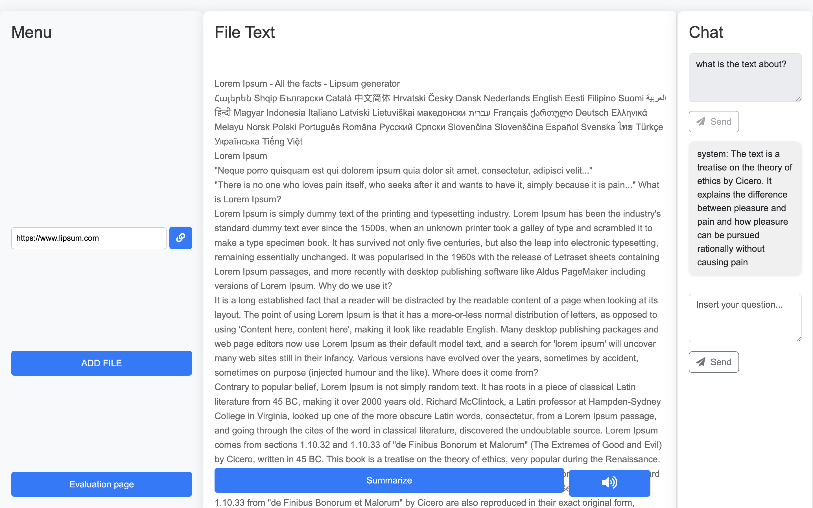
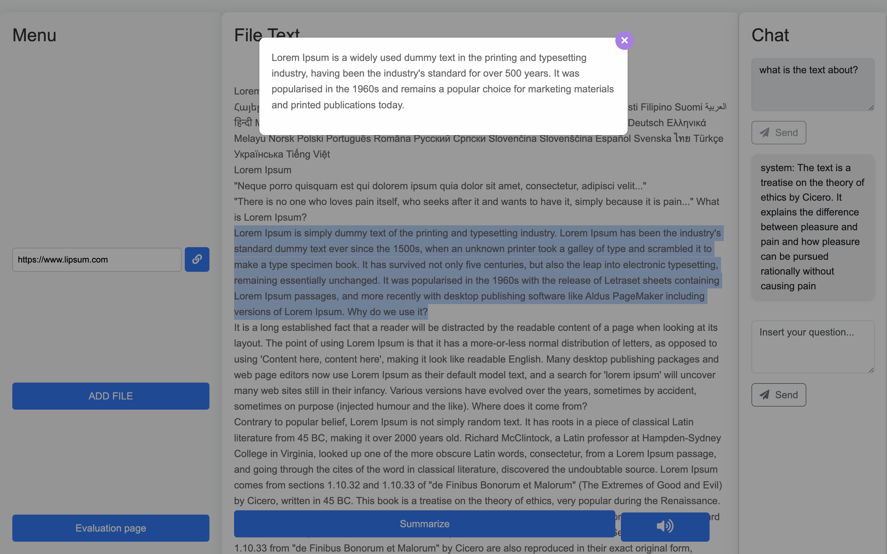
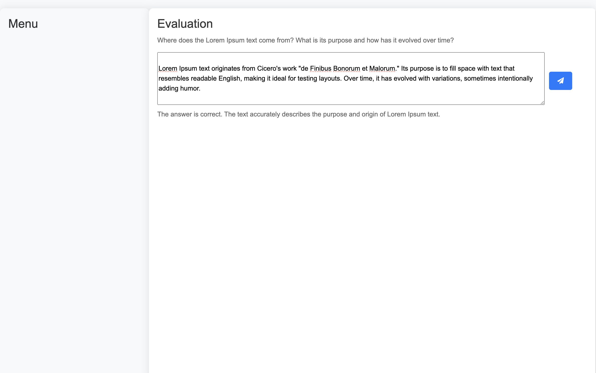

# stud-IA

**Please note that all of this code was written in less than 24h for a coding competition, badly in need of refactoring but works as is.**

To run the application locally:

1) run the server -> run server/app.py
2) run the client -> move to the UI folder and use the command *npm start* from the terminal

# Main page
* Upload PDFs or web pages
* Chat to get an answer regarding the text

# Summarize popup
* Summarize the entire text
* Summarize a selected part of the text
  

# Evaluate yourself
* Evaluate yourself by answering an ever-changing question regarding the text and finding out if you are right or why not
  

# Authors

* [Matteo Rigat](https://github.com/matteorigat)
* [Lorenzo Romeo](https://github.com/LorenzoRomeo0)
* [Giacomo Montali](https://github.com/jackmonta)
* [Andrea Cambiaghi](https://github.com/AndreaCambiaghi)
